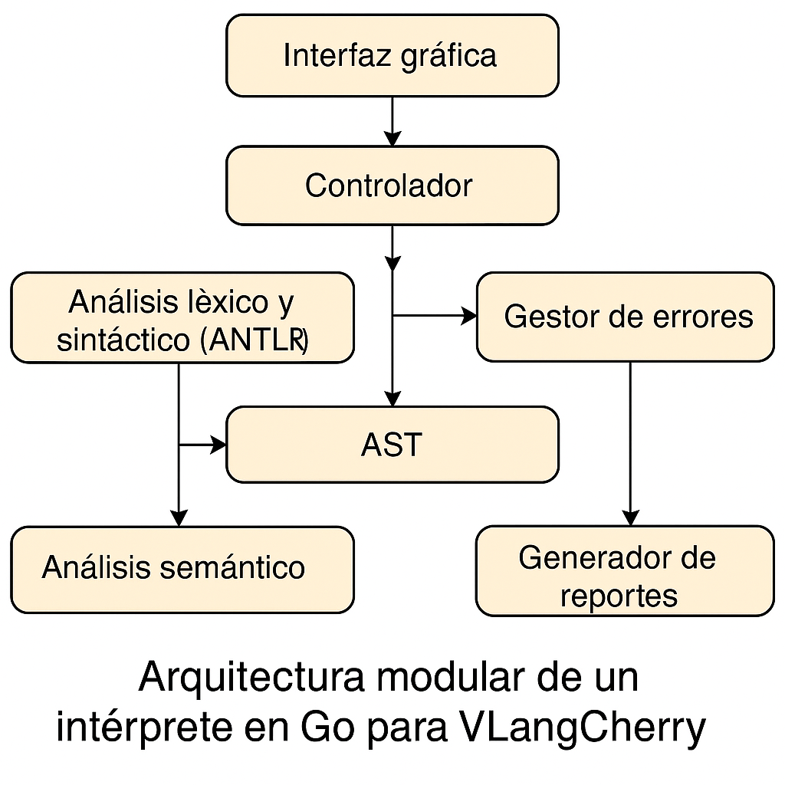
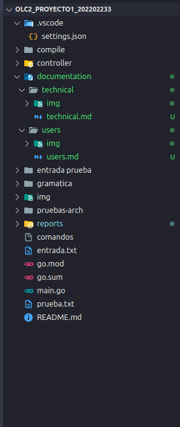

  

# **COMPILE  |  V-LANG CHERRY**
**Universiad San Carlos de Guatemala**   
**Facultad de Ingenieria**   
**Escuela de Ciencias y Sistemas**  
**Organización de Lenguajes y Compiladores 2**   
**Catedratico: Luis Fernando Espino**  
**Tutor Academico: Estuardo Sebastian Valle**  

| Nombre                                | Carné      |
|---------------------------------------|------------|
| Matthew Emmanuel Reyes Melgar         | 202202233  |
| Daniel Abraham Gálvez Solorzano       | 202203361  |
| Dilan Conaher Suy Miranda             | 201801194  |

---  

# **COMPILE  |  MANUAL TECNICO**

## INTRODUCCIÓN

El intérprete VLangCherry es una aplicación desarrollada en Go que implementa un entorno de análisis léxico, sintáctico y semántico para el lenguaje VLangCherry, inspirado en la sintaxis de Go y orientado a la enseñanza de conceptos de compiladores en ambientes de bajos recursos[3]. El sistema permite la edición, análisis, ejecución y reporte de código fuente a través de una interfaz gráfica y módulos especializados.

---

## ARQUITECTURA

El sistema está organizado en módulos que reflejan las fases clásicas de un intérprete: análisis léxico, análisis sintáctico, análisis semántico, construcción y recorrido del Árbol de Sintaxis Abstracta (AST), manejo de errores y generación de reportes. La arquitectura modular facilita la mantenibilidad y la extensión del sistema.

  

---

## ESTRUCTURA DEL PROYECTO

La estructura del proyecto, según la imagen proporcionada, es la siguiente:

- **compile/**: Contiene los módulos principales de análisis y ejecución.
  - *expresiones/*: Operaciones y expresiones del lenguaje.
  - *print/*: Funciones de impresión y salida.
  - *compileVisitor.go*: Implementación del visitor para el AST.
  - *environment.go*: Manejo de entornos y ámbitos.
  - *Error.go*: Gestión de errores.
  - *miFunct.go*: Funciones personalizadas.
  - *symbolsTable.go*: Implementación de la tabla de símbolos.
  - *utils.go*: Utilidades generales.
- **controller/**: Controladores para la compilación y generación de reportes.
  - *compile.go*: Lógica principal de compilación.
  - *dot_generator.go*: Generación de archivos DOT para visualización de árboles.
  - *searchTree.go*, *treeFormatter.go*: Manipulación y visualización de árboles.
- **documentation/**: Documentación técnica y de usuario.
- **reports/**: Reportes generados (errores, tabla de símbolos, AST).
- **gramatica/**: Gramáticas y archivos relacionados con ANTLR.
- **img/**: Recursos gráficos.
- **pruebas-arch/**: Archivos de prueba.
- Archivos raíz: *main.go*, *go.mod*, *go.sum*, *README.md*, archivos de entrada y prueba.

  

---

## REQUERIMIENTOS TECNICOS

### Hardware

- Procesador: Dual core 2.0 GHz o superior
- Memoria RAM: 2 GB mínimo
- Espacio en disco: 200 MB libres

### Software

- Sistema operativo: Linux (cualquier distribución moderna)
- Go (1.20 o superior)
- ANTLR (4.x)
- Framework de interfaz gráfica: Fyne, Electron, GTK o Gio

---

## COMPONENTES PRINCIPALES

- **Analizador Léxico y Sintáctico**: Generado con ANTLR, procesa el código fuente y construye el AST.

- **Analizador Semántico**: Verifica la coherencia de tipos, ámbitos y estructuras de control.
- **AST y Recorrido**: El AST se construye y recorre para interpretar el código y generar reportes visuales.
- **Tabla de Símbolos**: Estructura que almacena información sobre variables, funciones y sus contextos.
- **Gestor de Errores**: Detecta, almacena y reporta errores léxicos, sintácticos y semánticos.
- **Generador de Reportes**: Produce reportes detallados de errores, tabla de símbolos y AST.
- **Interfaz Gráfica**: Permite la edición, ejecución y visualización de resultados y reportes.

---

## INSTALACION Y CONFIGURACIONES INICIALES

1. **Clonar el repositorio** en el entorno Linux.

2. **Instalar Go** y ANTLR siguiendo la documentación oficial.
3. **Configurar variables de entorno** necesarias para ANTLR y Go.

4. **Compilar el proyecto** ejecutando `go build` en la raíz del repositorio.

5. **Ejecutar la aplicación** con el binario generado o desde la terminal con `go run main.go`.

---

## FLUJO INTERNO
1. **Carga del código fuente**: El usuario crea o abre un archivo TXT.

2. **Análisis léxico y sintáctico**: ANTLR genera el AST y detecta errores de sintaxis.
3. **Análisis semántico**: Se validan tipos, ámbitos y estructuras.
4. **Construcción y recorrido del AST**: Se interpreta el código y se generan reportes.
5. **Generación de reportes**: Se crean archivos de errores, tabla de símbolos y AST para consulta.
6. **Visualización**: Los resultados y reportes se muestran en la interfaz gráfica y la consola[3].

---

## MANEJO DE ERRORES Y REPORTES

- **Errores**: Se reportan con tipo, ubicación y descripción detallada.

- **Tabla de símbolos**: Incluye identificadores, tipos, ámbitos y posiciones.
- **AST**: Se genera en formato gráfico (DOT) para su visualización.
- **Archivos de reporte**: Se almacenan en la carpeta `reports/` y pueden ser consultados desde la interfaz.

---

## MANTENIMIENTO Y EXTENSION 

- **Agregar nuevas funciones**: Implementar en `miFunct.go` y registrar en la tabla de símbolos.

- **Extender la gramática**: Modificar archivos en `gramatica/` y regenerar analizadores con ANTLR.
- **Actualizar la interfaz**: Modificar los controladores y vistas según el framework elegido.
- **Documentación**: Mantener actualizados los archivos en `documentation/` y el `README.md`.

---

## FICHA TECNICA VLANG CHERRY

| **Campo**                    | **Detalle**                                                                                          |
|------------------------------|------------------------------------------------------------------------------------------------------|
| **Nombre del Proyecto**      | Intérprete del Lenguaje VLangCherry                                                                 |
| **Descripción**              | Intérprete funcional para el lenguaje VLangCherry, inspirado en Go, con análisis léxico, sintáctico y semántico, AST y reportes. |
| **Lenguaje de Programación** | Go                                                                                                   |
| **Herramienta de Análisis**  | ANTLR (para analizadores léxicos y sintácticos)                                                     |
| **Arquitectura**             | Modular, con interfaz gráfica y generación de reportes automáticos.                              |
| **Interfaz Gráfica**         | Fyne, Electron, GTK o Gio (según implementación)                                                    |
| **Sistema Operativo**        | Linux                                                                                                |
| **Extensión de Archivos**    | .vhc                                                                                                 |
| **Reportes Generados**       | Errores léxicos, sintácticos y semánticos; Tabla de símbolos; Árbol de Sintaxis Abstracta (AST). |
| **Soporte de Tipos**         | Primitivos (int, float64, string, bool), compuestos (slices, structs)                                |
| **Control de Flujo**         | if-else, switch-case, for, break, continue, return                                                  |
| **Funciones Embebidas**      | print, Atoi, parseFloat, reflect.TypeOf()                                                           |
| **Requerimientos Hardware**  | Procesador Dual core 2.0 GHz+, 2 GB RAM, 200 MB disco, 1024x768 pantalla                            |
| **Requerimientos Software**  | Linux, Go 1.20+, ANTLR 4.x, framework gráfico compatible                                            |
| **Funcionalidades**          | Edición, análisis, ejecución de código, generación y visualización de reportes, soporte de estructuras y funciones. |
| **Estado Actual**            | En desarrollo, con actualizaciones periódicas                                                        |
| **Licencia**                 | Uso académico, restringido a la Universidad de San Carlos de Guatemala                              |
| **Observaciones**            | Proyecto educativo para fortalecer conocimientos en compiladores y lenguajes de programación.     |

---

## GLOSARIO TECNICO

- **ANTLR**: Herramienta para generación de analizadores léxicos y sintácticos.

- **AST (Árbol de Sintaxis Abstracta)**: Estructura jerárquica que representa la sintaxis del código fuente.

- **Tabla de símbolos**: Estructura que almacena información de variables y funciones durante el análisis.

- **DOT**: Formato gráfico para visualización de árboles.
- **Interfaz gráfica**: Aplicación visual para interacción con el usuario.

---
