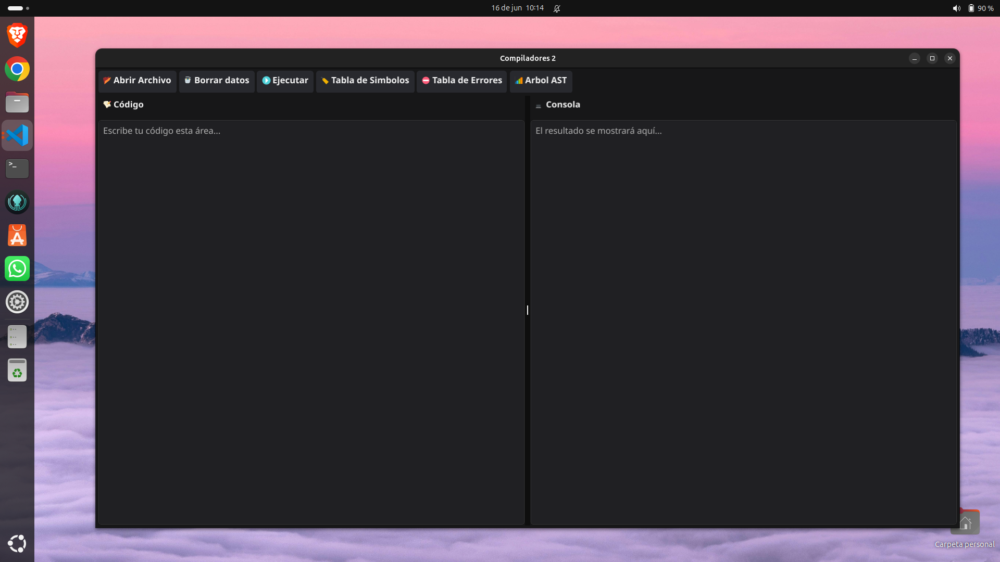
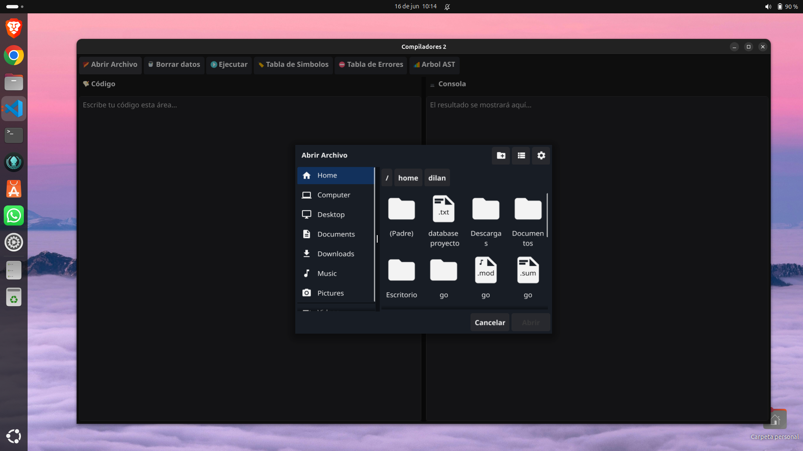
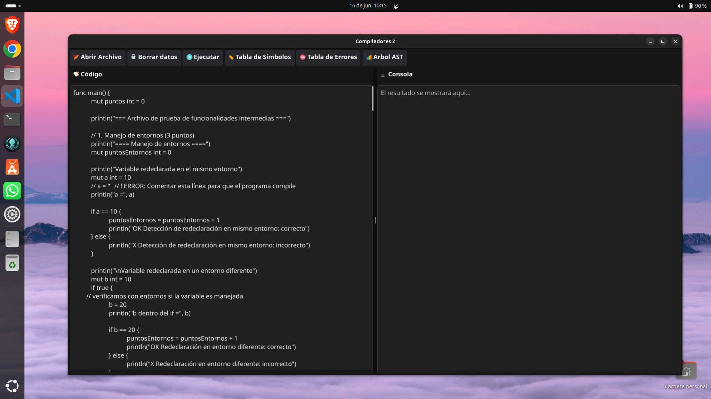
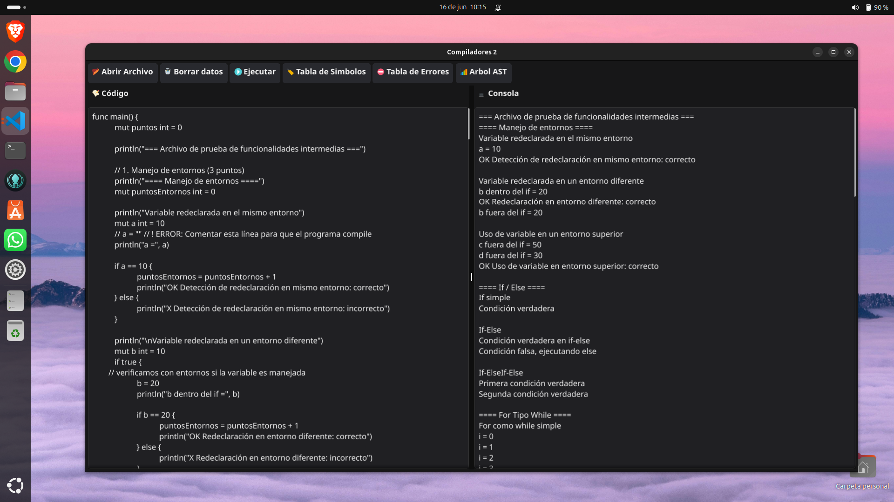
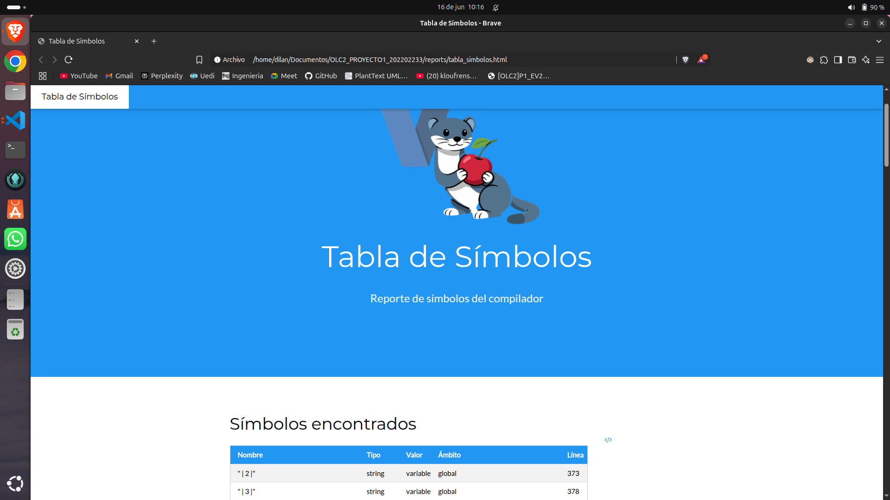
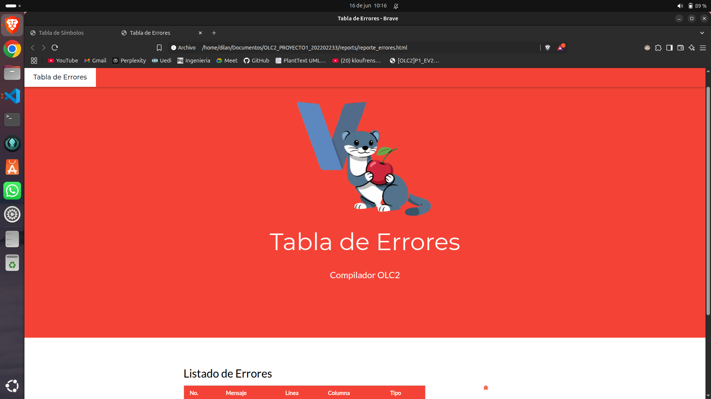
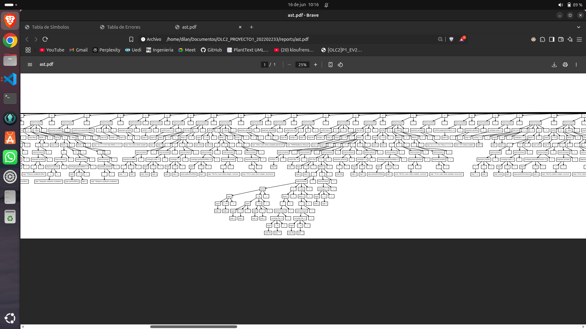

  

# **COMPILE  |  V-LANG CHERRY**
**Universiad San Carlos de Guatemala**   
**Facultad de Ingenieria**   
**Escuela de Ciencias y Sistemas**  
**Organización de Lenguajes y Compiladores 2**   
**Catedratico: Luis Fernando Espino**  
**Tutor Academico: Estuardo Sebastian Valle**  

| Nombre                                | Carné      |
|---------------------------------------|------------|
| Matthew Emmanuel Reyes Melgar         | 202202233  |
| Daniel Abraham Gálvez Solorzano       | 202203361  |
| Dilan Conaher Suy Miranda             | 201801194  |

---  

# **COMPILE  |  MANUAL DE USUARIO**

## INTRODUCCION
La Organización de Lenguajes y Compiladores es un área fundamental en la formación de ingenieros en ciencias y sistemas, ya que permite comprender los procesos internos de los lenguajes de programación y su implementación. En este contexto, el presente proyecto busca desarrollar un intérprete funcional para el lenguaje VLangCherry, inspirado en la sintaxis de Go pero adaptado para entornos de bajos recursos. El intérprete implementa las etapas esenciales de análisis léxico, sintáctico y semántico, así como la generación y recorrido del Árbol de Sintaxis Abstracta (AST), utilizando herramientas modernas como ANTLR y el lenguaje de programación Go. Además, se desarrolla una interfaz gráfica que facilita la creación, edición y ejecución de código, permitiendo a los estudiantes poner en práctica los conocimientos teóricos adquiridos y fortalecer sus competencias en el desarrollo de lenguajes y compiladores

## OBJETIVO GENERAL
Desarrollar un intérprete funcional para el lenguaje VLangCherry, aplicando los principios fundamentales de la teoría de compiladores, que permita analizar, validar e interpretar código fuente mediante una interfaz gráfica intuitiva y eficiente, asegurando la correcta identificación y manejo de errores léxicos, sintácticos y semánticos, así como la generación de reportes detallados sobre el proceso de análisis y ejecución

## OBJETIVOS ESPECIFICOS

- **Implementar un analizador léxico y sintáctico utilizando ANTLR**  
  Generar la gramática del lenguaje VLangCherry y emplear ANTLR para la creación automática del analizador léxico y sintáctico, permitiendo la identificación y validación de tokens y la estructura gramatical del código fuente.

- **Desarrollar un analizador semántico**  
  Implementar un sistema de análisis semántico que aplique reglas semánticas para garantizar la coherencia del lenguaje, validando declaraciones, tipos y ámbitos de variables y funciones.

- **Construir y recorrer el Árbol de Sintaxis Abstracta (AST)**  
  Desarrollar la construcción y recorrido del AST, generando reportes gráficos que muestren la estructura del árbol y la tabla de símbolos, facilitando la interpretación y ejecución del código.

- **Diseñar e implementar una interfaz gráfica**  
  Crear una interfaz gráfica que permita a los usuarios crear, editar, ejecutar y gestionar archivos de código VLangCherry, mostrando errores, resultados y reportes de análisis de manera intuitiva.

- **Generar reportes detallados**  
  Producir reportes de errores, tabla de símbolos y AST, que incluyan información relevante para el análisis y depuración del código fuente durante el proceso de desarrollo y ejecución.

---

## REQUISITOS DEL SISTEMA

### Hardware

- Procesador: Dual core 2.0 GHz o superior
- Memoria RAM: 2 GB mínimo
- Espacio en disco: 200 MB libres
- Resolución de pantalla: 1024x768 o superior

### Software

- Sistema operativo: Linux (cualquier distribución moderna)
- Go (versión 1.20 o superior)
- ANTLR (versión 4.x)
- Framework de interfaz gráfica: Fyne, Electron, GTK o Gio[1]

---

## INSTALACIÓN

1. **Descargue el repositorio** desde el enlace proporcionado por el desarrollador.

2. **Instale Go** y ANTLR siguiendo las instrucciones oficiales.

3. **Ejecute el instalador** o compile el proyecto según las instrucciones del README.

4. **Inicie la aplicación** desde el acceso directo o ejecutando el binario generado en la terminal[1].

---

## FLUJO DE LA APLICACION
A continuacion mostraremos cada una de las opciones del sistema Compile V-Lang el cual permite el ingreso un archivo txt el cual se muestra en el recuadro de codigo el cual puede ser editado desde ahi, luego de tener el codigo ya listo, podra ejecutar y generara en la consola la respuesta. Tambien tenemos las opciones de generar reportes y mostrara la informacion en archivos HTML y PDF

### Ventana Principal
En esta ventana principal se encuentra las diferentes opciones 

1. **Abrir Archivo**  
    Esta opcion permite que el usuario carge un archivo en formato txt para posteriormente editarlo.

2. **Borrar Datos**  
   En esta opcion le permite al usuario borrar todo el contenido tanto de consola como de codigo.

3. **Ejecutar**  
    Esta opcion permite al usuario interpretar su codigo cuando ya esta listo, este comando proporcionara el arbol de derivacion, la lista de simbolos y el reporte de errores.

4. **Lista de Simbolos**  
   Esta opcion genera un reporte en formato html el cual esta compuesto por una tabla.

5. **Lista de Errores**  
   Esta opcion genera un reporte en formato html el cual esta compuesto por una tabla.

6. **AST**  
   En esta opcion se genera el reporte del arbol de derivacion el cual contiene todas las acciones realizadas por el interprete.

 

### Abrir Archivo

1. **Abrir Archivo**  
    Esta opcion permite que el usuario carge un archivo en formato txt para posteriormente editarlo.

2. **Buscar un Archivo TXT**  
   En opcion se seleccionar un archivo y al aceptar el codigo del archivo se mostrara en el recuadro de codigo.

 

 

### Ejecutar

1. **Ejecutar**  
    Esta opcion permite que el usuario ya editando su codigo pueda ejecutarlo

2. **consola**  
   En opcion permite mostrar en el recuadro de consola los resultados del interprete del codigo.

 

### Tabla de Simbolos

1. **Archivo HTML**  
    La opcion de tabla de simbolos genera un reporte en archivo html para mostrarlo en el navegador.
.

 

### Tabla de Errores

1. **Archivo HTML**  
    La opcion de tabla de errores genera un reporte en archivo html para mostrarlo en el navegador.
.

 

### Arbol AST

1. **Archivo PDF**  
    La opcion genera un archivo PDF donde se genera el arbol de derivacion AST donde se encuentra todas los procesos del codigo.
.

 

---
## FUNCIONALIDAD PRINCIPAL

- **Edición de código**: Crear, abrir, editar y codigo V-Lang.

- **Análisis léxico, sintáctico y semántico**: Validación automática del código fuente.

- **Ejecución directa**: Interpretación y ejecución desde la interfaz.

- **Generación de reportes**: Errores, tabla de símbolos y AST.

- **Visualización en consola**: Resultados y notificaciones en tiempo real.

- **Soporte de estructuras de datos y funciones**: Manejo de slices, structs y funciones personalizadas.

---

## GENERACIÓN Y CONSULTA DE REPORTES

- **Errores**: Accesibles desde el panel de reportes tras la ejecución; incluyen tipo, ubicación y descripción del error.

- **Tabla de símbolos**: Muestra variables, funciones y su contexto.

- **AST**: Visualización gráfica del Árbol de Sintaxis Abstracta generado.

---

## RESOLUCIÓN DE PROBLEMAS COMUNES

| Problema                                  | Solución                                                                 |
|--------------------------------------------|--------------------------------------------------------------------------|
| El programa no inicia                      | Verifique la instalación de Go y ANTLR, y que cumple los requisitos.     |
| No se ejecuta el código                    | Revise la consola para errores léxicos, sintácticos o semánticos.        |
| No aparecen reportes                       | Asegúrese de ejecutar el código tras guardar los cambios.                |
| Errores de acceso a archivos               | Verifique permisos de lectura/escritura en la carpeta de trabajo.        |

---

## 9. Contacto y Soporte

Para soporte técnico, dudas o reportar errores, contacte a los tutores académicos o consulte la documentación oficial del proyecto en el repositorio de la Universidad de San Carlos de Guatemala, Facultad de Ingeniería.

---
